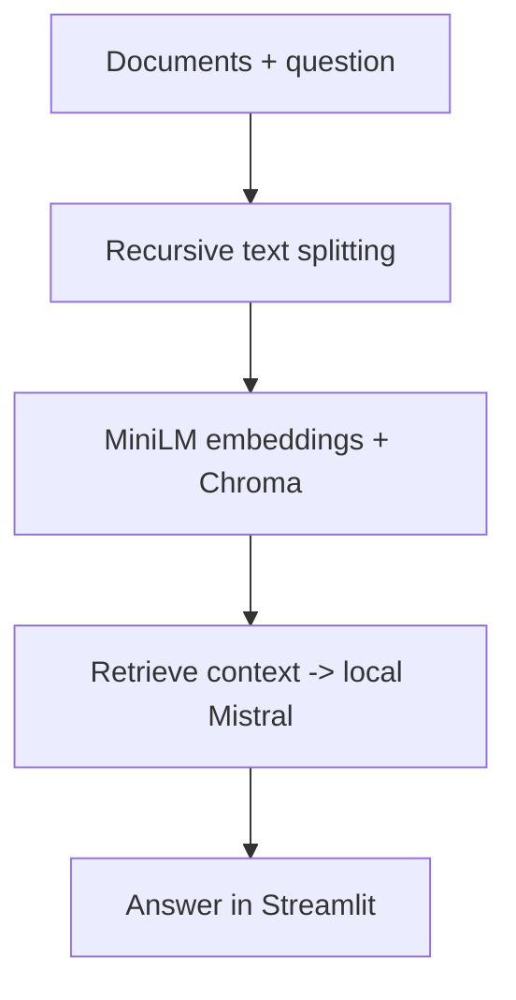

# Local Document Question Answering

Project report | Harsh Saand | 22 September 2026

## The problem

Retrieve relevant parts of a document collection before asking a local language model to answer a question.

## What a user gets

A Streamlit interface connects document processing and retrieval to an Ollama-hosted Mistral answer.

## Practical value

The source shows a document-to-answer workflow. Its practical benefit is inspectable local retrieval infrastructure; an independent evidence-recall or answer-faithfulness benchmark is not preserved.

## Logic and flow

<strong>Data and scope</strong>

Inputs are user documents. The public tree includes a persisted vector store, but document rights and provenance are not established here; this report does not reproduce its contents. The README references an upstream project, so contribution attribution remains important.

<strong>How it works</strong>

DocumentProcessor uses RecursiveCharacterTextSplitter. EmbeddingsManager uses all-MiniLM-L6-v2 and a persistent Chroma collection. RAGEngine creates an Ollama Mistral model and a RetrievalQA chain with a prompt template. These are pretrained components, not locally trained model weights.

<strong>Results and interpretation</strong>

No frozen evaluation set, per-question retrieval labels or grounded answer audit was found in the inspected tree. A generated answer is a functional output, not a verified correct answer.

<strong>Limitations and next steps</strong>

Reproduce in a clean environment, use an explicitly public document set, retain citations and unsupported-answer cases, and compare lexical retrieval with embeddings. Preserve upstream attribution.

## Evidence and reproduction references

Source revision: 4a39a243acac8016df6d758a13f43b516448e3f5

- [README.md](https://github.com/HarshSaand/rag/blob/4a39a243acac8016df6d758a13f43b516448e3f5/README.md)
- [__init__.py](https://github.com/HarshSaand/rag/blob/4a39a243acac8016df6d758a13f43b516448e3f5/__init__.py)
- [document_processor.py](https://github.com/HarshSaand/rag/blob/4a39a243acac8016df6d758a13f43b516448e3f5/document_processor.py)
- [embeddings_manager.py](https://github.com/HarshSaand/rag/blob/4a39a243acac8016df6d758a13f43b516448e3f5/embeddings_manager.py)
- [rag_engine.py](https://github.com/HarshSaand/rag/blob/4a39a243acac8016df6d758a13f43b516448e3f5/rag_engine.py)
- [stmain.py](https://github.com/HarshSaand/rag/blob/4a39a243acac8016df6d758a13f43b516448e3f5/stmain.py)
- [test_data.py](https://github.com/HarshSaand/rag/blob/4a39a243acac8016df6d758a13f43b516448e3f5/test_data.py)

This report describes the source and saved evidence at the revision above. Training and full benchmark runs were not repeated for this documentation release. Dataset, model and dependency licences remain separate from the project documentation.
